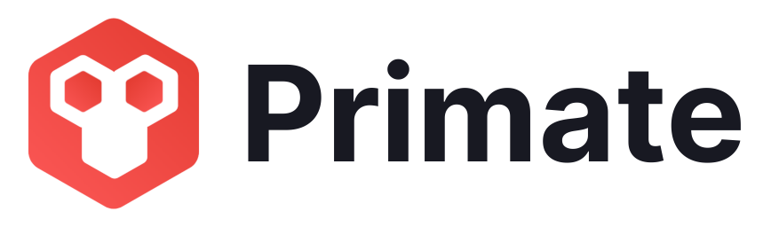

<div align="center">
    
    <p>Primate (formerly KongDash) is a modern desktop client for Kong Admin API</p>
    <p><a href="https://www.getprimate.xyz">getprimate.xyz</a></p>
    <p></p>
</div>

---

## Download and Install 

Builds are available for major desktop operating systems.

#### On Windows
Download the [latest](https://github.com/getprimate/primate/releases/latest) executable setup file and run it.

#### On Mac OS X
Download and open the [latest](https://github.com/getprimate/primate/releases/latest) .dmg image, move the app to /Applications.

#### On Linux
Primate is available as AppImage and tar.gz archive for all popular Linux distributions. 

- Download the [latest](https://github.com/getprimate/primate/releases/latest) .AppImage.
- Make it executable `$ sudo chmod a+x Primate-version-x64.AppImage`.
- Run Primate `$ ./Primate-version-x64.AppImage`.

_For Ubuntu users:_

Primate can also be installed from the [Snapcraft](https://snapcraft.io/primate) store.

## Contribute
There are several ways to support development:

- Provide feedbacks and suggest improvements.
- Contribute to the development with pull requests.


### For Developers
- Requires NodeJs (v16.13.2 or higher) and yarn (v1.22.17 or higher).
- Built with [Electron](https://www.electronjs.org/).

#### Build and Run

Clone the repository, install dependencies and start.
```shell
$ git clone https://github.com/getprimate/primate
$ cd primate
$ yarn install
$ yarn start
```

#### Package the Application

To package the application for your operating system, run: 

```shell
$ yarn run compile
$ yarn run dist
```

The binaries will be written to `/dist` directory.

Run `$ yarn run clean` to clean the output directories.

_Currently, compiling to non-native binary is disabled._

## License
MIT License. See [LICENSE](LICENSE).
