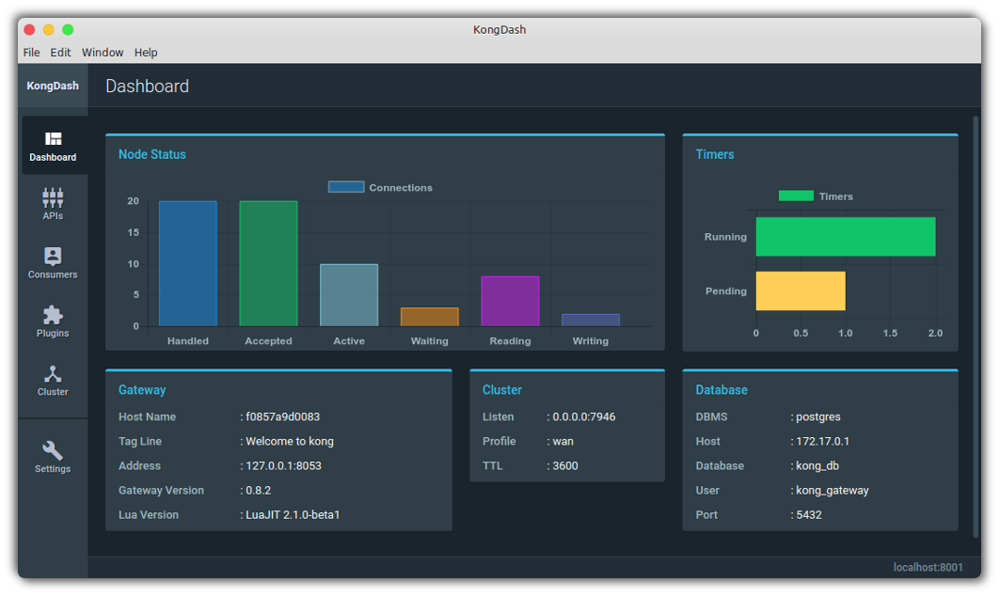

# KongDash

> An elegant desktop client for [Kong](https://getkong.org/) admin API

[](https://raw.githubusercontent.com/ajaysreedhar/kongdash/master/screenshot.png)

<!--### How to Install

#### On Linux
_Ubuntu and other Debian distributions:_

- Download the [latest](https://github.com/ajaysreedhar/kongdash/releases) .deb package. 
- Run `dpkg -i kongdash-x.y.z-arch.deb`


_Fedora and other Linux distributions:_

- Download the [latest](https://github.com/ajaysreedhar/kongdash/releases) .tar.gz archive.
- Extract the archive and run install.sh script.

```shell
tar -xvf kongdash-x.y.z-linux-arch.tar.gz
cd kongdash-x.y.z-linux-arch
./install.sh
```

_x.y.z refers to the version number and arch refers to the architecture (ia32 or x64)._

#### On Windows
Simply download the [latest](https://github.com/ajaysreedhar/kongdash/releases) .exe installer and run it.

#### On Mac OS X
Download and open the [latest](https://github.com/ajaysreedhar/kongdash/releases) .dmg image, move the app to /Applications to start using it.
-->
### For Developers
All kinds of contributions are welcome.

- Requires NodeJs (v4.4.7 or higher but <= v11.5 for graceful compatibility) and npm (v2.15.8 or higher).
- Built with [Electron](http://electron.atom.io/).

Clone the repository
```shell
git clone https://github.com/dcoli/kongdash
```

Install dependencies
```shell
npm install
```

Run the app
```shell
npm start
```

Run ESLint
```npm test``` or ```npm run lint```
### Releases

The [latest release](https://github.com/dcoli/kongdash/releases/tag/v0.3.1) is currently available for MacOS and Linux. No installers are available for Linux.


### Make a release

Linux 32-bit:
```shell
npm run pack:linux32
```

Linux 64-bit:
```shell
npm run pack:linux64
```

Mac OS X (64-bit only):
```shell
npm run pack:osx
```

Windows 32-bit:
```shell
npm run pack:windows32
```

Windows 64-bit:
```shell
npm run pack:windows64
```

The packaged application will be moved to release/ directory.

### License
MIT License. See [LICENSE](LICENSE).
